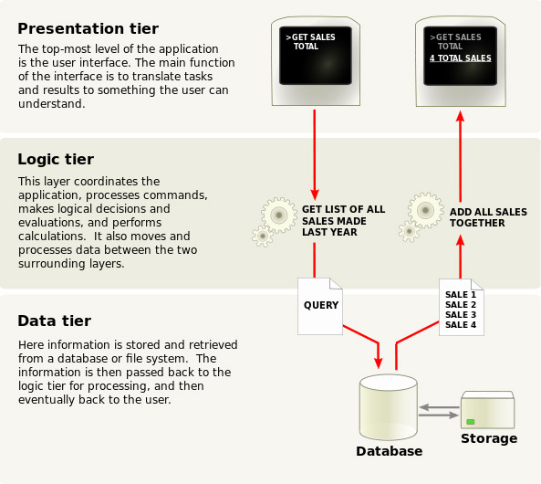

# Angular<span style="color:#a81713">JS</span>

### Superheroic JS MVW Framework

<small>**CHA SUNG WON** / **[darth.vader@navercorp.com](mailto:darth.vader@navercorp.com)**</small>


...page

<!-- .slide: data-background="slides/angularjs/evolution_web.png" -->

### [The Evolution of the Web](http://www.evolutionoftheweb.com/)


...more

<!-- .slide: data-background="slides/angularjs/evolution_web.png" -->

### pure javascript <!-- .element: class="fragment" data-fragment-index="1" -->
``` 
var buttons = document.getElementsByTagName("button");
for (var i = 0; i < buttons.length; i++) {
	if (buttons[i].addEventListener) {
		buttons[i].addEventListener("click", function () {
			alert("clicked");
		}, false);
	} else if (buttons[i].attachEvent) {
		buttons[i].attachEvent("onclick", function () {
			alert("clicked");
		});
	}
	buttons[i].innerHTML = "click me!";
}
```
<!-- .element: class="fragment" data-fragment-index="1" -->

### jQuery	<!-- .element: class="fragment" data-fragment-index="2" -->
``` 
$("button").on("click", function (event) {
	alert("clicked");
}).html("click me!");
```
<!-- .element: class="fragment" data-fragment-index="2" -->


...more

<!-- .slide: data-background="slides/angularjs/evolution_web.png" -->

### RequireJS

### Backbone, Ember (MVC) <!-- .element: class="fragment" data-fragment-index="2" -->

### NODE js <!-- .element: class="fragment" data-fragment-index="3" -->

### ... <!-- .element: class="fragment" data-fragment-index="4" -->

### AngularJS (2009) <!-- .element: class="fragment" data-fragment-index="4" -->


...page


<small style="font-family:나눔고딕;">**AngularJS : MVC 패턴을 구현하는 자바스크립트 프레임워크** (한빛미디어, 2013년 7월)</small>


...page

### The History of AngularJS

Started by Misko Hevery in 2009, [Google Feedback](https://www.google.com/tools/feedback)


GWT = 3 developers, 6 months, 17000 LOC <!-- .element: class="fragment" data-fragment-index="1" -->

AngularJS = <!-- .element: class="fragment" data-fragment-index="2" --> ** 1 developer, 3 weeks <span style="color:#a81713">(-95.8%)</span>, 1500 LOC <span style="color:#a81713">(-91.1%)</span> ** <!-- .element: class="fragment" data-fragment-index="2" -->


...page

### Our Project : ORIGAMI


BEFORE : [origami.navercorp.com/Bucket](http://test.adbucket.navercorp.com/Bucket)

AFTER : [origami.navercorp.com](http://test.adbucket.navercorp.com/outlaw/index.html)

- - -

JESTER : 7190 LOC, 148435 bytes <!-- .element: class="fragment" data-fragment-index="1" -->

AngularJS : <!-- .element: class="fragment" data-fragment-index="2" --> ** 4984 LOC <span style="color:#a81713">(-30.6%)</span>, 93296 bytes <span style="color:#a81713">(-37.1%)</span> ** <!-- .element: class="fragment" data-fragment-index="2" -->


...page

### Web Development




...page

### Hello World

```
<!doctype html>
<html ng-app>
<head>
<scrip+ src="https://ajax.googleapis.com/ajax/libs/angularjs/1.2.14/angular.js"></scrip+>
</head>
<body>
<div>
	<label>Name:</label>
	<input type="text" ng-model="name" placeholder="Enter your name here">
	<hr>
	<h1>Hello {{name}}</h1>
</div>
</body>
</html>
```
<small>**[CODEPEN](http://codepen.io/skywalker/pen/zsLic)**</small>


...more

### Data Binding

```
$scope.profile = {
	name: "Albert",
	age: 35
};
```

```
{{profile.age}}								// 1-way
<input ng-model="profile.name" type="text">	// 2-way
```
<small>**[CODEPEN](http://codepen.io/skywalker/pen/CisrF)**</small>


...more

### Directives

```
<div ng-controller="SampleCtrl">
	<div ng-repeat="article in news.articles">
		<span ng-bind="article.title"></span>
	<div>
</div>

<custom-tag></custom-tag>

<div data-my-own-property> . . . </div>
```

```
.directive("customTag", function() {
	return {
		replace: true,
		restrict: "E",
		transclude: true,
		template: "<div> . . . <\/div>",
		controller: function($scope) {
			// controller code
		}
	};
});
```
<small>**[CODEPEN](http://codepen.io/skywalker/pen/IFaqr)**</small>

###### Custom Directives, Built-In Directives


...more

### Dependency Injection

```
.controller('LoginController', function($scope, $rootScope, $location,
										$http, $cookieStore, LoginService) {

	$scope.login = function() {
		LoginService.authentificate( . . . ), function(user) {
			. . .
		}
	};
});
```
<small>**[CODEPEN](http://codepen.io/skywalker/pen/CisrF)**</small>

### Service, Filter ... <!-- .element: class="fragment" data-fragment-index="1" -->


...page

### TODO list app


#### Requirements

##### - add Task
##### - archive Task
##### - counting & filtering
##### - realtime-sync
##### - decorate

</small>


...more

### STEP 1 : Basic Functions <small>**[CODEPEN](http://codepen.io/skywalker/pen/xDKJr)**</small>

##### - add Task
##### - archive Task
##### - counting & filtering

<br>

### STEP 2 : SYNC (socket.io) <!-- .element: class="fragment" data-fragment-index="1" --> <small>**[CODEPEN](http://codepen.io/skywalker/pen/EviFe)**</small> <!-- .element: class="fragment" data-fragment-index="1" -->

<br>

### STEP 3 : Decorate (bootstrap) <!-- .element: class="fragment" data-fragment-index="2" --> <small>**[CODEPEN](http://codepen.io/skywalker/pen/bfsjh)**</small> <!-- .element: class="fragment" data-fragment-index="2" -->

<br>

### Result : <!-- .element: class="fragment" data-fragment-index="3" --> [TODOS](http://codepen.io/skywalker/full/jdkEn) <!-- .element: class="fragment" data-fragment-index="3" --> <small style="vertical-align:middle">**[preview](http://www.dev.mobilefarms.com/mosa/simulator)**</small> <!-- .element: class="fragment" data-fragment-index="3" -->

<br>

#### [Some More Stuff...](http://codepen.io/skywalker/full/pCHwD) <!-- .element: class="fragment" data-fragment-index="4" -->


...more

### Server-side (socket.io)

```
var io = require("socket.io").listen(9321),
	fs = require("fs");

io.sockets.on("connection", function (socket) {

	fs.readFile("todos.json", "utf8", function (err, data) {

		if (err) {
			throw err;
		}

		socket.emit("update:msg", data);
		
		socket.on("broadcast:msg", function (data) {
	
			socket.broadcast.emit("update:msg", data.message);
			writeToFile(data.message);
		});		
	});
});

function writeToFile(data) {

	fs.writeFile("todos.json", data, function (err) {
		if (err) {
			console.log(err);
		} else {
			console.log("updated!");
			console.log(data.message);
		}
	});
}
```


...page

### AngularJS [Batarang](http://scifi.stackexchange.com/questions/22277/are-batarangs-aerodynamic-enough-to-fly)


...page

### EXTRA

IDE : chrome devtools, chrome workspace

SASS / LESS / icon fonts

Choosing Libraries

[AngulaJS seminar Invitation](http://10.64.51.102/reveal.js/invite.html)

markdown : [script for this doc.](pbxbp_angularjs.md)


...page

# Thank you.

## and See You Again!
